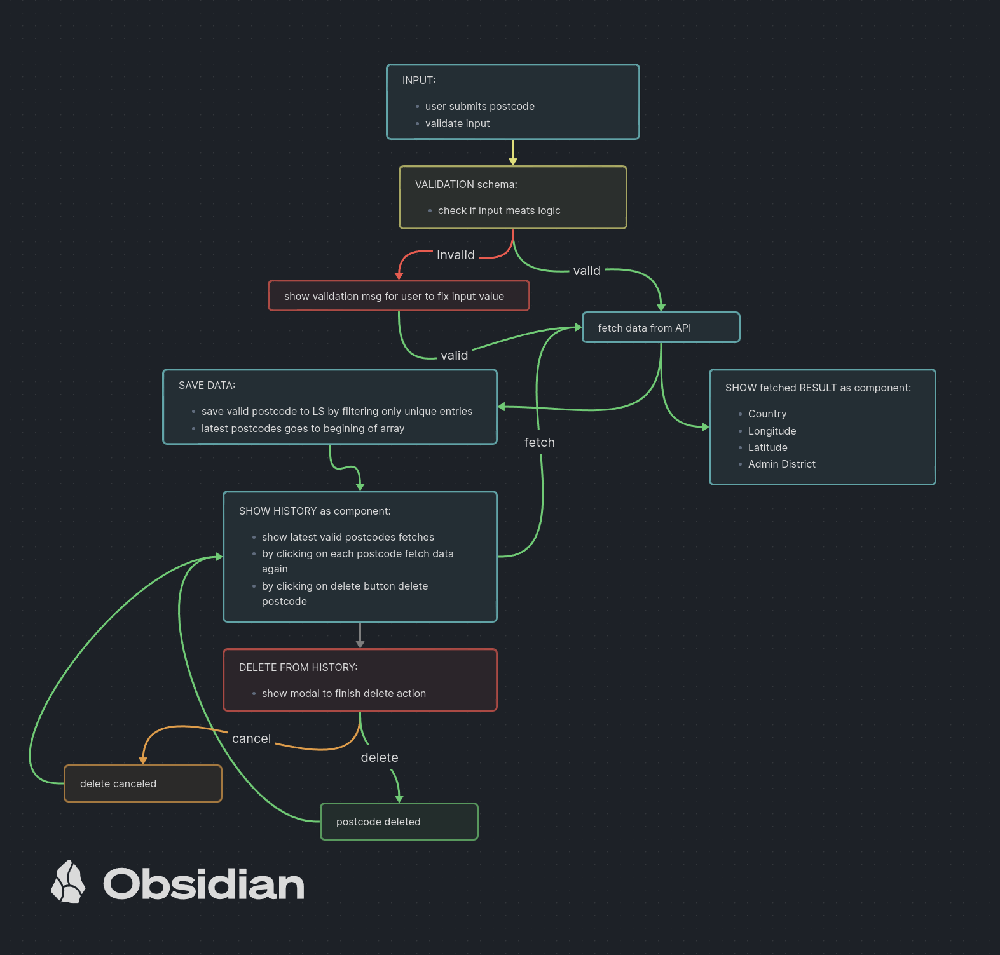

Simple React app to fetch API endpoint - `api.postcodes.io/postcodes/:postcode` with user provided postcode.

TLDR schema:
<br>


Live site can be found [here](https://dkumza.github.io/postcodes-api-front/)

App created with Vite (if you use `npm`, then replace `yarn` accordingly):

```bash
yarn create vite new-app-name --template react
cd new-app-name
yarn # to install modules
code . # to open with your favorite editor, replace 'code'
yarn dev # to start dev server
```

Dependencies I have used:

- [vite](https://react-redux.js.org/tutorials/quick-start#install-redux-toolkit-and-react-redux)
- [tailwindcss](https://tailwindcss.com/docs/guides/vite)
- [react-redux](https://react-redux.js.org/tutorials/quick-start#install-redux-toolkit-and-react-redux)
- [formik](https://www.npmjs.com/package/formik)
- [yup](https://www.npmjs.com/package/yup)
- [axios](https://www.npmjs.com/package/axios)
- [react-toastify](https://www.npmjs.com/package/react-toastify)
- [react-spinners](https://www.npmjs.com/package/react-spinners)

```bash
# for tailwind fallow docs page provided above
# all other dependencies can be installed by using yarn or npm
yarn add @reduxjs/toolkit react-redux formik yup axios react-toastify react-spinner
```

To run my project:

```bash
git clone https://github.com/dkumza/postcodes-api-front
cd postcodes-api-front
# for npm users replace yarn accordingly with npm
yarn # to install modules
code . # or any your favorite editor (vim?)
yarn dev # to start dev server
```

To build finished project run:

```bash
# while in project dir run:
yarn build # or npm run build
```

To test builded app locally:

```bash
# while in project dir run:
yarn preview # or npm run preview
```

I use Github Actions to create GitHub pages. This allows to check out / test builded static site online.
For more info read [here](https://vitejs.dev/guide/static-deploy.html#github-pages)
